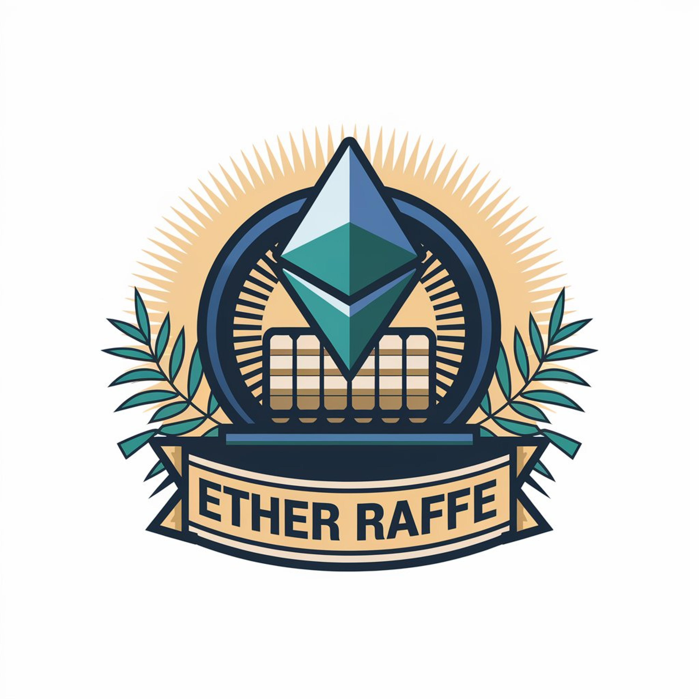

# Ether Raffle

<p align="center">

</p>

## About

Ether Raffle is a decentralized raffle system where users can participate by depositing ETH. Once the raffle reaches a set number of participants, a random winner is selected, and the total ETH in the pool is allocated to the winner.

This project leverages Chainlink's Verifiable Random Function (VRF) for generating secure, verifiable random numbers, ensuring that the raffle outcome is fair and trustworthy.

## Features

- **Secure Entry**: Users can join by sending a minimum amount of ETH, with requirements enforced on-chain.
- **Random Winner Selection**: Uses Chainlink VRF to select a winner, ensuring true randomness and transparency.
- **Automatic Raffle Reset**: Once a winner is picked, the raffle resets, ready for the next round.
- **Manager-Controlled Raffle**: The manager is responsible for initiating the winner selection but cannot influence the outcome.
- **Configurable Player Limit**: The manager can set the maximum number of players required to start the winner selection.

## User Flow

1. Users enter the raffle by sending ETH to the contract.
2. Once the set player limit is reached, the raffle closes.
3. The manager calls the `pickWinner` function to initiate random winner selection.
4. Chainlink VRF generates a random number, which determines the winner.
5. The ETH pool is awarded to the winner, and the raffle resets for the next round.

## Contract Structure

The Ether Raffle contract includes the following key components:

- **Raffle Logic**:
  - `enter()`: Allows users to join the raffle by sending ETH.
  - `pickWinner()`: Allows the manager to initiate winner selection once the player limit is reached.
  - `fulfillRandomness()`: Called by Chainlink VRF to complete the winner selection using a secure random number.
  - `claimRewards()`: Allows the winner to claim their rewards.
  - `setMaxPlayers()`: Allows the manager to configure the maximum player count per raffle.

- **Chainlink VRF Integration**:
  - `getRandomNumber()`: Requests a random number from Chainlink VRF.
  - `fulfillRandomness()`: Processes the random number and selects the winner from the participant pool.


## Roles

### Manager
The manager initializes the winner selection by calling `pickWinner`. The manager does not control the random number or the outcome of the raffle, ensuring a fair and unbiased process. The manager is also allocated a protocol fee from each raffle.

### Player
Players enter the raffle by calling `enter()` with a minimum of 0.001 ETH. Players can also claim their rewards through `claimRewards()` after the raffle concludes.

## Usage

### Entering the Raffle

Players can enter the raffle by calling the `enter()` function and sending at least 0.001 ETH. Players that do not meet the minimum entry requirement are excluded from the raffle.

### Picking a Winner

Once the player limit is reached, the manager can call `pickWinner()` to request a random number from Chainlink VRF. Chainlink processes the request and calls `fulfillRandomness()` to determine the winner and distribute the rewards.

### Claiming Rewards

Winners can claim their rewards by calling `claimRewards()` with the desired amount. If the winner wants to claim all available rewards, they can pass `type(uint256).max` as the `amount` parameter.


## Installation and Deployment

1. **Build the Project**

    ```shell
    forge build
    ```

2. **Run Tests**

    ```shell
    forge test
    ```

3. **Deploy the Contract**

    Deploy the contract using Foundry, specifying the Chainlink VRF subscription ID, VRF Coordinator address, and key hash:

    ```shell
    forge create --rpc-url <YOUR_TESTNET_RPC_URL> --private-key <YOUR_PRIVATE_KEY> src/Raffle.sol:Raffle --constructor-args <SUBSCRIPTION_ID> <VRF_COORDINATOR_ADDRESS> <KEY_HASH>
    ```

4. **Configure Chainlink VRF Subscription**: Ensure the deployed contract is listed as a consumer on the Chainlink VRF subscription to enable random number requests.

## Testing

The raffle contract includes tests to verify its functionality:

- **Entry and Exit**: Tests to verify users can enter and claim rewards.
- **Manager Role**: Tests to ensure only the manager can initiate winner selection.
- **Chainlink VRF Integration**: Tests to simulate Chainlink’s VRF, ensuring random winner selection functions correctly.

Run the tests using:

```shell
forge test